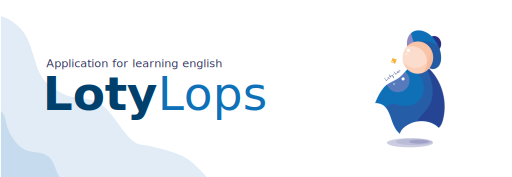
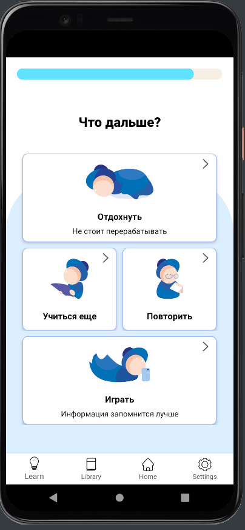

## Technologies

### Code

- Language: **java**;
- Data persistence: **SqLite**, **Firebase (Firestore, Storage, Auth)**;
- Utils: **Text-To-Speech**.

> I want to rewrite this app using kotlin and more modern technologies, but the size of this app is huge for one human, it would take very much time :scream_cat:

### Others

- Prototype: **Miro**;
- Design: **Figma**;
- Icons: **Inkscape**, **Adobe Illustrator**, **Paint Tool Sai**;
- Managing: **Trello**.

## Functions

### Get info

Learn **6** several sections: 

- Vocabulary ::no_mouth::;
- Phraseology ::thinking::;
- Grammar :books:;
- Grammar exceptions :dizzy_face:;
- Phonetics :sound:;
- Culture :black_flag:.

Learn only what you wants: select courses yourself. 

You can add your own vocabulary course and change existing word cards.

### Customize your learning

You can set your learning:

- change the velocity of studying (how much information you will learn per day) :fast_forward:;
- change the frequency of repeating (how often you will repeat information) :repeat:;
- select the approach to study (for vocabulary, phraseology, grammar, and phonetics) :relieved:;
- customize information on your word cards (customize definition and examples appearance) :nerd_face:;

Lotylops helps you to set your learning when you open the app the first time: 

- select the approaches to study;
- select time of studying per day;
- take some tests and get courses according to our level.

&nbsp;&nbsp;&nbsp;&nbsp;&nbsp;&nbsp;&nbsp;&nbsp;&nbsp;&nbsp;&nbsp;&nbsp;

### Learn and practice

Learning and practicing are connected.  You will repeat information, but the longer you learn it the less often you repeat it. Every step of repeating is connected to the practice task. If you'll fail this task - you will repeat this information as often as in the beginning. 

There are 9 types of practice tasks for vocabulary and phraseology, 3 for grammar, and one for other sections. You can practice more after you do the necessary work.

&nbsp;&nbsp;&nbsp;&nbsp;&nbsp;&nbsp;&nbsp;&nbsp;&nbsp;&nbsp;&nbsp;&nbsp;

&nbsp;&nbsp;&nbsp;&nbsp;&nbsp;&nbsp;&nbsp;&nbsp;&nbsp;&nbsp;&nbsp;&nbsp;

### Game

After doing the necessary work you can play.

You will compete with an enemy by doing tasks. You will be able to select the difficulty of tasks and start doing them in a short time. The one who will have done it worse will have lost some health. The one who will have lost all health will have been defeated. The is another mechanic - the one who wins 5 times in a row becomes a winner :muscle:.​

You can't get tired of the app fast: games and extra practice are available only after required learning, and you need to pay for special activities with coins you get for doing the required work.

### Statistics

Get statistics about your progress: level, frequency of learning, performance progress, achieves. The app uses statistics to know if it is required to correct the study plan to achieve better performance.

## About app

### The sense of the application

I wanted to learn English using apps, and I have tried to find an appropriate one for so long so I decided to create mine. 

#### What I disliked in such applications:

- You can't remember anything or can't use in speech what have you learned;
- The motivation runs off really fast;
- There is not enough information about the context;
- Many applications don't teach you to speak, or write sentences;

##### There are six main thoughts that **Lotylops** stands for:

- **Remembering and practicing** should be together :handshake:;
- **Keeping statistics** about the user study progress is for helping them to correct their learning, not just for looking on it :monocle_face:;
- The user should be able to **select appropriate approaches** to study :yellow_heart:;
- The app should give as **much information** about words and rules as possible. Simple word-translate cards are inefficient and boring :nerd_face:;
- **Discipline** is as significant as motivation (or even more). The app should prevent the user from being tired of learning :writing_hand:;
- Mixing **systematical learning and fun games** gives more **motivation**, helps to keep the user for long to until they get used to studying :smile:.

### Research article
This app was used for research articles: 'the development of an effective application for learning a foreign language' and 'the application for learning a foreign language 'Lotylops'' and was presented at several conferences: 🤓
- 11.2020: "Российская научно-социальная программа для молодежи и школьников 'Шаг в будущее'. Региональный этап соревнования молодых ученых Европейского союза. 2 Региональная молодежная научная конференция" - призер 3 степени
- 11.2020: "Российская научно-социальная программа для молодежи и школьников 'Шаг в будущее'. Региональный этап соревнования молодых ученых Европейского союза. 14 соревнование молодых исследователей программы 'Шаг в будущее' в Северо-Западном федеральном округе Российской федерации" - диплом победителя
- 02.2020: "9 Российская научная конференция учащихся Юность. Наука. культура." - лауреат 1 степени
- 07.2020: "XXXI Международная конференция 'Современные информационные технологии в образовании'" - диплом за лучший доклад
- 10.2020: "Международный дистант форум научной молодежи 'Шаг в будущее'. Всероссийский этап" - диплом 2 степени
- 11.2020: "Региональный этап Соревнования молодых учёных Европейского Союза. III Региональная бизнес-школа-выставка" - Призер 2 степени, Специальные призы промышленных
предприятий, организаций и бизнес-структур: ПАО «Ростелеком» за практическую значимость проектов, направленных на решение актуальных задач региона, ГОБУ «Мурманский региональный инновационный бизнесинкубатор» за решение актуальных проблем современного общества.
- 02.2021: "Всероссийский конкурс научных работ 'Юниор'" - Призер 2 степени

### More info

- **Figma design** - https://www.figma.com/file/SUxfMVvqsrBVJcwhtbxmN4/LotyLops---%D0%BD%D0%B5-%D1%82%D0%B0%D0%BA%D0%BE%D0%B9-%D0%BA%D1%80%D0%B8%D0%B2%D0%BE%D0%B9-%D0%B4%D0%B5%D0%B7%D0%B8%D0%B3%D0%BD?node-id=0%3A1
- **Presentation** - https://docs.google.com/presentation/d/1zefP7daUWhPTqjUdUXycehs1EaqftpLe/edit?usp=sharing&ouid=102428718605921677572&rtpof=true&sd=true
- **App in google play** - https://play.google.com/store/apps/details?id=com.lya_cacoi.lotylops
- **Comparison of apps for learning English** - https://docs.google.com/spreadsheets/d/1O2c9x0qFZRTX0uJ1FJ6D2khaqrhZLR1E/edit?usp=sharing&ouid=102428718605921677572&rtpof=true&sd=true
- **Survey: Teachers chose the most appropriate application** - https://docs.google.com/spreadsheets/d/1W5u4VxCE7eHF3XETdy4ENTHkK0vXEydU/edit?usp=sharing&ouid=102428718605921677572&rtpof=true&sd=true
- **Research article** - https://drive.google.com/file/d/15610gQYB0oMicpinMFddV3ND2EyebEXR/view?usp=sharing
